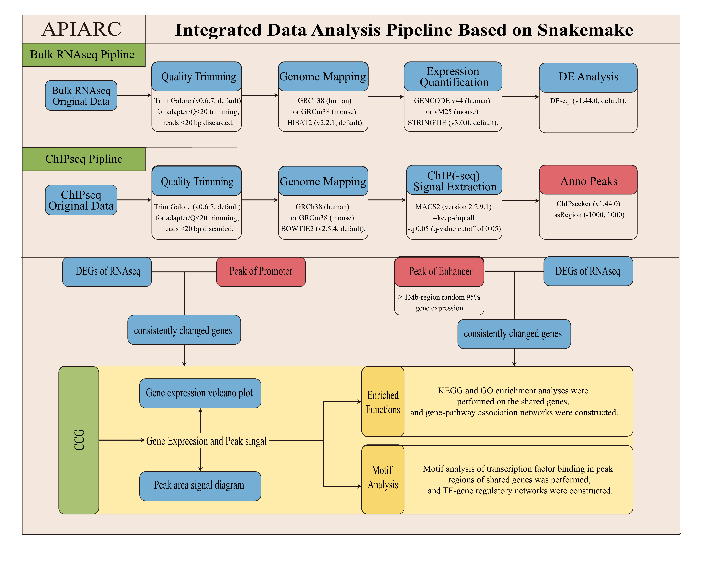

💎 APIARC: Automated Pipeline for Integrated Analysis of RNA-seq and ChIP-seq
===========================================================================

🧉 Introduction
----------------
**APIARC** is a modular, flexible, and fully automated workflow based on **Snakemake** designed for the comprehensive and integrated analysis of RNA-seq and ChIP-seq data. 

While there are many pipelines that analyze RNA-seq or ChIP-seq individually, APIARC bridges the gap by not only processing raw data from both sequencing types but also performing deep biological integration. It identifies co-regulated genes, links Enhancer and Promoter signals, performs functional enrichment (KEGG/GO), and infers Transcription Factor (TF) - Gene regulatory networks, generating Cytoscape-ready files for network visualization.

🐍 Workflow
------------


The APIARC workflow consists of three main parallel and sequential branches:

1. **RNA-seq Pipeline**: From raw data download (SRA) $\rightarrow$ QC (FastQC/fastp) $\rightarrow$ Alignment & Quantification (Hisat2/StringTie) $\rightarrow$ Differential Expression Analysis (DESeq2).
2. **ChIP-seq Pipeline**: From raw data download $\rightarrow$ QC (Trim Galore) $\rightarrow$ Alignment & Filtering (Bowtie2/Picard) $\rightarrow$ Peak Calling (MACS2) & Signal Track Generation (deepTools).
3. **Integrated Analysis**:
   - **Promoter Module**: Integrates ChIP-seq peaks at promoter regions with RNA-seq DEGs.
   - **Enhancer Module**: Associates distal Enhancer peaks with target genes using correlation analysis.
   - **Network Module**: Generates GO/KEGG functional enrichment networks and TF-Gene regulatory networks (exportable to Cytoscape).

📂 Input and Output
-------------------
### Input format
1. **Config file (`config.yaml`)**: The main configuration file to set up reference genomes, thread counts, and general pipeline switches.
2. **Metadata (`config/RNAseq_metadata.csv` & `ChIPseq_metadata.csv`)**: Tabular data defining the sample names, their corresponding SRR IDs, and experimental groups (e.g., Treatment vs Control).
3. **Raw Data (Optional)**: The pipeline can automatically download raw reads from NCBI SRA using the SRR IDs provided. Alternatively, users can place local `.fastq.gz` files in the raw data directories.

### Output directories
All results are structured in the `result/` directory:
1. `RNAseq_pipline/`: Contains `1_Rawdata`, `2_Cleandata`, `3_RC_pipline` (BAM/GTF/Counts), and `4_DEseq` (Differential expression tables and plots).
2. `ChIPseq_pipline/`: Contains `1_Rawdata`, `2_Cleandata`, `3_CC_pipline` (BAM/BigWig), and `4_peak_result` (MACS2 peaks and deepTools matrix).
3. `Integrated/`: 
   - **Promoter Module**: Identifies common genes between DEGs and ChIP promoter peaks, plotting expression vs. ChIP signal correlations. Performs KEGG/GO enrichment (Gene-KEGG/GO networks) and TF motif binding analysis (TF-Gene networks).
   - **Enhancer Module**: Identifies common genes between DEGs and ChIP enhancer peaks, mapping correlations. Generates corresponding KEGG/GO enrichment networks and TF-Gene regulatory networks.

⚙️ Installation
----------------
### Dependencies
The pipeline relies on Conda for environment management. The core software dependencies include:
- `snakemake`
- `fastp`, `trim_galore`, `fastqc`
- `hisat2`, `bowtie2`, `samtools`, `picard`
- `stringtie`, `macs2`, `deeptools`
- **Python 3**: `pandas`, `numpy`, `concurrent.futures`
- **R 4.0+**: `DESeq2`, `ChIPseeker`, `ComplexHeatmap`, `clusterProfiler`

### Clone the repository
```bash
git clone https://github.com/nculiujy/APIARC.git
cd APIARC
```

### Setup Environments
APIARC uses Conda environments defined in `workflow/envs/`. Snakemake will automatically create and use these environments when you run the pipeline with the `--use-conda` flag (if configured).

Alternatively, you can manually build the core environments:
```bash
conda env create -f environment.yml
conda activate APIARC
```

🚀 Usage
---------
The `config/` directory serves as the control center of the APIARC pipeline. Before running the pipeline, users must configure the following files according to their experimental design:

### 1. Main Configuration (`config/config.yaml`)
This YAML file defines global parameters and module switches:
- **`species`**: Define the species for reference genome mapping and annotations (e.g., `"mm"` for Mouse, `"homo"` for Human).
- **`experiment`**: Used for project naming or data fetching (e.g., `"GSE140552"`).
- **`RNAseq_modules` / `ChIPseq_modules` / `Integrated_modules`**: Boolean switches (`True` or `False`) to toggle specific analysis steps on or off.

### 2. RNA-seq Metadata (`config/RNAseq_metadata.csv`)
A comma-separated file describing your RNA-seq samples.
- **`sample`**: The unique identifier or SRR ID of the sample (e.g., `SRR10485905`). If using local data, this should match the prefix of your `.fastq.gz` files.
- **`sample_name`**: A readable biological name for the sample (e.g., `NMuMG_Veh_1`).
- **`group`**: The experimental condition used for Differential Expression Analysis (DESeq2). Use `"T"` for Control/Vehicle and `"P"` for Treatment.

### 3. ChIP-seq Metadata (`config/ChIPseq_metadata.csv`)
A comma-separated file detailing the ChIP-seq sample pairings for Peak Calling.
- **`IP sample`**: The SRR ID or prefix of the IP (treatment) `.fastq.gz` file.
- **`Input`**: The SRR ID or prefix of the corresponding Input (control) `.fastq.gz` file.
- **`IP_name`**: The target name or group label (e.g., `H3K4me1_rep1`). Replicates should be indicated by suffixes like `_rep1` and `_rep2` so the pipeline can properly merge them during integrated analysis.

### Running the Pipeline
Once the configuration is correctly set, execute the pipeline from the project root.

To run the complete integrated pipeline locally with 30 cores:
```bash
snakemake -c 30 --rerun-incomplete
```

To run a dry-run (to check which rules will be executed without actually running them):
```bash
snakemake -n
```

If you encounter network instability during data download, the pipeline has built-in retry mechanisms and will fail safely if the data cannot be acquired.
